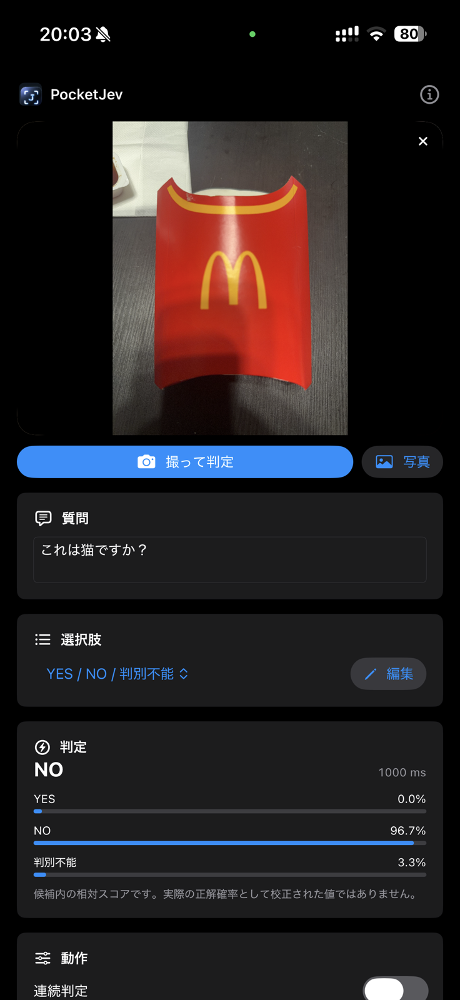

# PocketJev

**Pocket-sized, on-device visual decisions for iPhone.**

PocketJev is an experimental iOS app that turns a small vision-language model
into a fast multiple-choice decision tool. Instead of asking the model to write
a long description, PocketJev presents a question and 2–26 choices, then reads
the next-token logits for `A / B / C / ...` and shows the model's relative score
for each choice.

Typical uses include:

- `YES / NO / UNKNOWN` visual checks
- object / part presence checks
- framing and composition checks
- `PASS / RETRY / REBUILD` style review flows
- quick camera-based classification with custom option sets

> PocketJev is a decision UI, not a calibrated classifier. The displayed
> percentages are relative scores among the supplied choices; they are **not**
> probabilities that the answer is correct.

## Real-device example

<p align="center">
  
</p>

In this iPhone example, the question is **"Is this a cat?"** and the image is a
fries carton. PocketJev selects `NO` from `YES / NO / UNKNOWN`. The displayed
scores are still option-relative model scores, not calibrated confidence.

## Features

- Native SwiftUI iPhone app
- Camera capture and Photos picker
- Direct option-logit scoring; no free-form answer generation in the decision path
- Editable questions
- Reusable option-set dropdowns with a separate editor
- Default `YES / NO / UNKNOWN` option set
- 1 / 2 / 5 second continuous-decision mode without queuing stale frames
- Light haptic feedback after a decision
- Japanese UI when the iPhone language is Japanese; English otherwise
- On-device MLX inference after the model has been downloaded
- No image-upload or telemetry path in the app

## Model

PocketJev currently uses:

[`mlx-community/Qwen3-VL-2B-Instruct-4bit`](https://huggingface.co/mlx-community/Qwen3-VL-2B-Instruct-4bit)

The model is downloaded on first use and cached on the iPhone. The current
Hugging Face artifact is about **1.78 GB**, uses **4-bit MLX weights**, and is
published under the **Apache-2.0** license.

The model weights are **not** included in this repository.

## How it works

```text
camera image / photo
        +
question + option set
        ↓
Qwen3-VL on MLX Swift
        ↓
next-token logits for A/B/C/...
        ↓
relative score per option
```

The app intentionally avoids generating a natural-language response for the
decision itself. This keeps the output simple and avoids JSON parsing / repair.

The current iPhone implementation still re-encodes the image for every
decision. Shared vision-feature / prefix reuse from the macOS prototype is not
yet ported.

## Requirements

- Xcode 26 or newer is recommended for the current project configuration
- iOS 18+
- An iPhone with enough memory to load the 2B 4-bit VLM
- Network access for the first model download
- [XcodeGen](https://github.com/yonaskolb/XcodeGen) to regenerate the Xcode project

The underlying `mlx-swift-lm` package supports iOS, and this project targets
iOS 18.

## Build

```bash
git clone https://github.com/NullPo-jp/PocketJev.git
cd PocketJev

xcodegen generate
open PocketJev.xcodeproj
```

In Xcode:

1. Select the `PocketJev` target.
2. Choose your Development Team.
3. Change the example bundle identifier (`com.example.PocketJev`) to a unique one.
4. Select your iPhone and Run.

For command-line builds, SwiftPM plugin/macro validation may need to be allowed
or explicitly skipped depending on your Xcode security settings.

## Language behavior

PocketJev intentionally keeps localization simple:

- iPhone language = Japanese → Japanese UI / `判別不能`
- any other iPhone language → English UI / `UNKNOWN`

Custom option sets are user data and are not automatically translated.

## Privacy

Images are processed locally by the on-device model. The app does not contain
an image-upload or telemetry path. Network access is used to obtain the model
from Hugging Face on first setup. See [PRIVACY.md](PRIVACY.md).

## Accuracy notes

This is an experimental decision interface, not a production quality-control
system. A broad question such as "Is this render acceptable?" can be less
reliable than smaller observation questions such as "Is any part cut off by the
image border?" or "How many knobs are visible?".

If a wrong decision would matter, add an explicit `UNKNOWN` / `判別不能` option
and verify the workflow with your own held-out examples.

## Tech stack

- Swift 6 / SwiftUI
- AVFoundation
- [MLX Swift](https://github.com/ml-explore/mlx-swift)
- [mlx-swift-lm](https://github.com/ml-explore/mlx-swift-lm)
- Hugging Face Swift packages
- Qwen3-VL 2B 4-bit MLX model

## Status

Working prototype. Camera input, option-logit scoring, custom option sets,
localization, model caching and continuous mode are implemented. Quantitative
iPhone latency / accuracy benchmarks are not yet published.

## License

PocketJev source code is available under the [MIT License](LICENSE).

Model weights and third-party dependencies keep their own licenses. In
particular, the current Qwen3-VL MLX model is distributed separately under
Apache-2.0.

---

## 日本語

PocketJev は、iPhone のカメラや写真を **長文生成ではなく少数択判定** に
使う実験的なオンデバイスAIアプリです。

質問と2〜26個の選択肢を与え、Qwen3-VL が次に出そうとする `A / B / C ...`
のlogitを直接読み、各選択肢の相対スコアを表示します。

初回だけ約1.78GBのモデルをHugging Faceから取得し、その後の推論はiPhone上で
実行します。表示される割合は**正解確率として校正された値ではありません**。

日本語設定のiPhoneでは日本語UI、それ以外では英語UIになります。
初期選択肢は日本語では `YES / NO / 判別不能`、それ以外では
`YES / NO / UNKNOWN` です。

上の実機スクリーンショットでは、ポテトの容器に対して「これは猫ですか？」と
質問し、`YES / NO / 判別不能` から `NO` を選んでいます。表示値はあくまで候補内の
相対スコアで、校正済みの正解確率ではありません。

実用する場合は、いきなり「この画像は合格？」と聞くより、
「画像端で見切れているか」「部品が何個見えるか」のような観測質問へ分解する
方が扱いやすい設計です。
